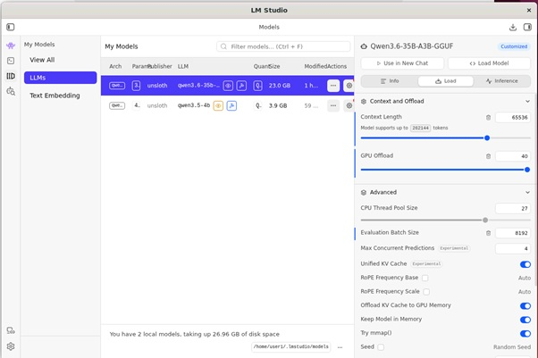
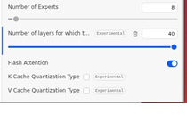

# Цель

Автоматизация проверок кодовой базы проектов с использованием LLM, запущенной на собственном / локальном сервере

# Примеры практического использования

Контроль выполненных дипломных проектов по ИТ-специальностям

# VPS|VDS

Минимальный из доступных на рынке. ОС -- Linux, т.е. с возможностью управлять маршрутизацией через iptables

Использованные варианты:

1. RuVDS
- Linxdatacenter: Россия, Санкт-Петербург
- Ubuntu 22.04 LTS (ENG)
- 1x2.2ГГц, 0.5Гб RAM, 1IP
- 10Гб HDD RAID (Операционная система)

2. VDSina
- Ubuntu 22.04 
- CPU: 1 core 
- RAM: 1 Gb
- Storage: 10 Gb
- Traffic: 1 Tb


Установлен [openvpn-сервер](https://habr.com/ru/articles/912336/)

Прописаны настройки доступа к [серверу LLM](#сервер-llm):

Для [llama-cpp](#установка-и-запуск-llama.cpp), VDS с IP 195.133.13.56, LLM-сервера с ip внутри openvpn-сети 10.8.0.7
```bash
iptables -t nat -A PREROUTING -d 195.133.13.56 -p tcp --dport 8080 -j DNAT --to-destination 10.8.0.7
```

Для [lm-studio](#настройки-lm-studio), VDS с IP 195.133.13.56, LLM-сервера с ip внутри openvpn-сети 10.8.0.7
```bash
iptables -t nat -A PREROUTING -d 195.133.13.56 -p tcp --dport 1234 -j DNAT --to-destination 10.8.0.7
```

Сохранение:
```bash
netfilter-persistent save
```

Дополнительные команды:
```bash
iptables -t nat -v -L PREROUTING -n --line-number # список настроенных правил
iptables -t nat -D PREROUTING 13                  # удаление правила за номером 13
```

# Сервер LLM

## Параметры

В соответствии с [рекомендациями](https://habr.com/ru/articles/1026482/) для использования [Qwen3.6 35B-A3B](https://huggingface.co/unsloth/Qwen3.6-35B-A3B-GGUF/tree/main).

Тестирование проводилось на двух ПК:

- ПК 1: Ubuntu 24.04 / Intel 2600K / GTX 1070 8Gb / 32 Gb RAM / llama.cpp
- ПК 2: Ubuntu 22.04 / Intel(R) Xeon(R) CPU E5-2697 v4 @ 2.30GHz / RTX 3050 8Gb / 256 Gb RAM / LM-Studio | llama.cpp

Установлен openvpn-клиент

## Настройки LM-Studio:




## Установка llama.cpp
```bash
cd ~
sudo apt update
sudo apt install build-essential git cmake ccache
```
### Вариант 1 для GTX 1070:

Ремарка:

Реальной поддержки F16 у GTX 1070 нет, но нужно ставить, чтобы llama.cpp могла ее эмулировать. Это позволяет использовать `--cache-type-v q8_0` (или `f16`) и разместить модель в памяти вместе со всем контекстом, на который модель способна.

```bash
wget https://developer.download.nvidia.com/compute/cuda/repos/ubuntu2204/x86_64/cuda-keyring_1.1-1_all.deb
sudo dpkg -i cuda-keyring_1.1-1_all.deb
sudo apt-get update
sudo apt-get -y install cuda-toolkit-11-8 # Стабильнее всего работает с GTX | Pascal
git clone https://github.com/ggml-org/llama.cpp.git # В последней версии уже появляется ошибка 
cd llama.cpp
# Включаем возможность использования видеокарты Nvidia Pascal
cmake -B build\
 -DGGML_CUDA=ON\
 -DGGML_CUDA_F16=ON\ 
 -DCMAKE_CUDA_ARCHITECTURES=61\
 -DCMAKE_INTERPROCEDURAL_OPTIMIZATION=ON
cmake --build build --config Release -j$(nproc)
```

### Вариант 2 для RTX 3050:
```bash
wget https://developer.download.nvidia.com/compute/cuda/repos/ubuntu2204/x86_64/cuda-keyring_1.1-1_all.deb
sudo dpkg -i cuda-keyring_1.1-1_all.deb
sudo apt-get update
sudo apt-get -y install cuda-toolkit-13
git clone https://github.com/ggml-org/llama.cpp.git
cd llama.cpp
# Включаем возможность использования видеокарты Nvidia
cmake -B build\
 -DGGML_CUDA=ON\
 -DGGML_CUDA_F16=ON\
 -DCMAKE_CUDA_ARCHITECTURES=86\
 -DCMAKE_INTERPROCEDURAL_OPTIMIZATION=ON
cmake --build build --config Release -j$(nproc)
```
## Автозапуск llama.cpp

```bash
sudo nano /etc/systemd/system/llama-cpp.service
```

## Оптимальные конфигурации запуска модели на ограниченных ресурсах

Критическая идея: 

**Загрузка только Experts в GPU:** `-ngl 40 -ncmoe 40`

### Вариант 1. RTX 1070 + CPU с количеством ядер до 4

- Можно задать `--flash-attn off`, тогда
  - квантование кэша значений не получится использовать, следовательно: 
    - меньший размер контекста `-c 98304`
- Можно задать `--flash-attn on`, тогда llama.cpp будет его эмулировать программно, что существенно снизит скорость на этапе чтения кода, но есть и плюсы:
  - можно задавать `--cache-type-k q8_0 --cache-type-v q8_0` и, как следствие:
    - повысить кэш до `-c 196608`(занимает 6,7 Gb VRAM; можно `-c 262144`, но это займет 7,9 Gb VRAM, на расширение в ходе работы mmproj не хватает)
- Можно вообще не задавать `--flash-attn Х` и задать `--cache-type-k q8_0 --cache-type-v q8_0` -- llama.cpp сама разберется.

Дополнительно рекомендуется задать:
- Количество ядер CPU для загрузки / выгрузки моделей `-t 4`
- Максимальный размер пачки токенов, которую сервер может принять на вход и начать обрабатывать за один логический шаг `-b 4096` (можно `-b 8192`)
- Физический размер под-пачки, которая непосредственно отправляется на исполнение в вычислительные ядра (в CUDA на GPU или в потоки CPU) за один физический такт `-ub 1024`
- Возможность обработки изображений `--mmproj /home/user/Downloads/Q3.6-35B-mmproj-F16.gguf`


```sh
[Unit]
Description=llama-server 
After=network.target

[Service] 
Type=simple
WorkingDirectory=/home/user/llama.cpp 
ExecStart=/home/user/llama.cpp.2205/build/bin/llama-server -m /home/user/Downloads/Qwen3.6-35B-A3B-UD-Q4_K_M.gguf --mmproj /home/user/Downloads/Q3.6-35B-mmproj-F16.gguf -ngl 40 -ncmoe 40 -c 196608 -b 4096 -ub 1024 -t 4 --cache-type-k q8_0 --cache-type-v q8_0 --host 0.0.0.0 --port 8079
RestartSec=10

[Install] 
WantedBy=default.target
```


### Вариант 2. RTX 3050 + Intel(R) Xeon(R) CPU E5-2697 v4 @ 2.30GHz

Основное отличие: 
- Есть возможность свободно использовать `--flash-attn on --cache-type-k q8_0 --cache-type-v q8_0`, задавать контекст на максимальном уровне
- Количество ядер для загрузки / выгрузки моделей `-t 16`

```sh
[Unit]
Description=Llama.cpp Server
After=network.target

[Service]
Type=simple
WorkingDirectory=/home/user/llama.cpp
ExecStart=/home/user/llama.cpp/build/bin/llama-server -m /home/user/.lmstudio/models/unsloth/Qwen3.6-35B-A3B-GGUF/Qwen3.6-35B-A3B-UD-Q4_K_M.gguf --mmproj /home/user1/.lmstudio/models/unsloth/Qwen3.6-35B-A3B-GGUF/mmproj-F16.gguf -ngl 40 -ncmoe 40 -c 65536 -b 8192 -t 16 --flash-attn on --cache-type-k q8_0 --cache-type-v q8_0 --host 0.0.0.0 --port 8078
Restart=always

[Install]
WantedBy=default.target
```


### Вариант 3 RTX 3090

Можно выгрузить все веса (а не только активные) в GPU: `-ngl 99`, что дает значительную производительность. При этом, приходится использовать `q8_0`. Объем занимаемой памяти 23654MiB /  24576MiB

```sh
[Unit]
Description=llama-server 
After=network.target

[Service] 
Type=simple
WorkingDirectory=/home/user/llama.cpp 
ExecStart=/home/user/llama.cpp/build/bin/llama-server -m /home/user/.lmstudio/models/unsloth/Qwen3.6-35B-A3B-GGUF/Qwen3.6-35B-A3B-UD-Q4_K_M.gguf -ngl 99 -c 196608 -b 8192 -ub 256 -t 4 --flash-attn on --timeout 600 --cache-type-k q8_0 --cache-type-v q8_0 --host 0.0.0.0 --port 8181 
Restart=always

[Install] 
WantedBy=default.target
```

## Локальный ПК для запуска [opencode](https://github.com/anomalyco/opencode/blob/dev/README.ru.md)

Любой ПК -- в соответствии с [документацией](https://github.com/anomalyco/opencode/blob/dev/README.ru.md)

Тестирование проводилось на ПК:
- Host ОС -- Windows 11 Home -> WSL: KaliLinux:2026.1
- Intel Ultra 125H
- 32 Gb RAM

### Установка opencode на Локальный ПК:

```bash
curl -fsSL https://opencode.ai/install | bash
```

```bash
git clone http://195.133.13.56/danil1online/EITSynthAI.git
cd EITSynthAI
nano opencode.json # или nano ~/.config/opencode/opencode.json
```
Пример заполнения `opencode.json` или `~/.config/opencode/opencode.json`
- `opencode.json` размещается в локальной папке и действует только в ее пределах
- `~/.config/opencode/opencode.json` -- конфиг для учетной записи пользователя

**Обратить внимание**
- `unsloth/qwen3.6-35b-a3b` -- не критично для llama.cpp, но если LLM-сервер поднят на lm-studio, знать точное название обязательно. Модели размещаются при этом в `/home/user/.lmstudio/models/unsloth/` 
- параметры `"limit": {"context": 196608,"output": 16384}` делают возможным наблюдение за расходом контекста, иначе opencode показыват всегда 0 % (правая часть пользовательского интерфейса) 

```sh
{
  "$schema": "https://opencode.ai/config.json",
  "model": "openai-compatible/qwen-local",
  "provider": {
    "openai-compatible": {
      "npm": "@ai-sdk/openai-compatible",
      "name": "Local Llama.cpp",
      "options": {
        "baseURL": "http://195.133.13.56:8079/v1"
      },
      "models": {
        "qwen-local": {
          "id": "unsloth/qwen3.6-35b-a3b",
          "attachment": true,
          "modalities": {
            "input": ["text", "image"],
            "output": ["text"]
          },
          "limit": {
            "context": 196608,
            "output": 16384
          }
        }
      }
    }
  },
  "tools": {
    "websearch": true,
    "webfetch": true,
    "codesearch": true
  },
  "permission": {
    "websearch": "allow",
    "webfetch": "allow",
    "codesearch": "allow",
    "read": "allow",
    "edit": "allow",
    "bash": "allow",
    "external_directory": "allow"
  }
}
```
Запуск из анализируемого каталога:

```bash
opencode
```
или
```bash
opencode -m openai-compatible/qwen-local
```
или (при необходимости восстановления контекста)
```bash
opencode -c
```
или
```bash
opencode -c -m openai-compatible/qwen-local
```
-> Tab для перехода в режим планирования / анализа
-> "Какие улучшения для проекта можешь предложить?"